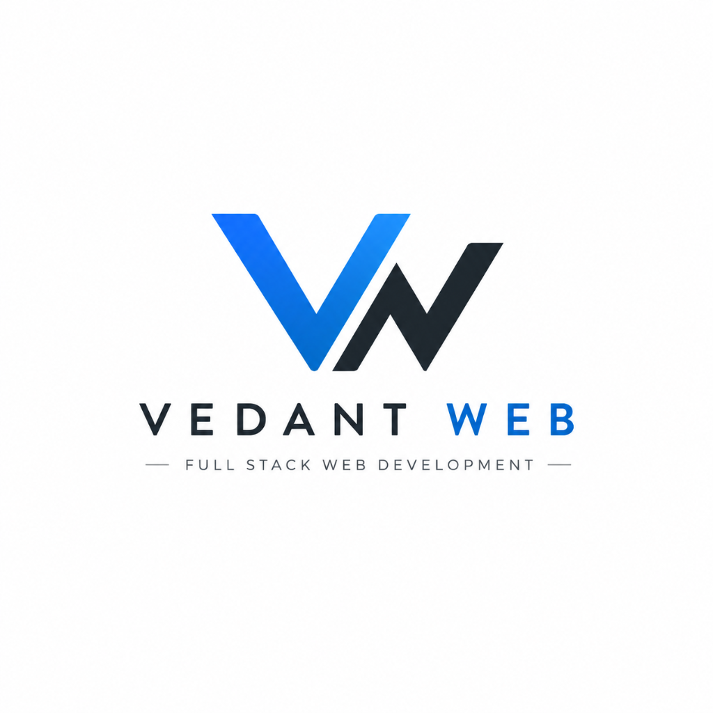

# 🚀 Vedant Web — Premium Websites in Budget & Digital Growth

### High-Impact, Modern Websites Starting at Just **₹999/-** & Social Media Growth Services
*Fast Delivery · Mobile Responsive · SEO Ready · 100% Client Satisfaction*

[🌐 Live Website](https://vedantweb-official.github.io/) • [💼 View Portfolio](https://vedantweb-official.github.io/projects.html) • [📩 Contact & Quote](https://vedantweb-official.github.io/contact.html)

---

## 💡 About Vedant Web

**Vedant Web** is your dedicated technology and growth partner. We build lightning-fast, visually stunning, and conversion-focused websites tailored specifically for small businesses, startups, creators, and entrepreneurs without the exorbitant agency price tag.

Whether you need a quick online presence to establish credibility, a full-featured custom web platform, or a rapid boost in your social media reach, we deliver results on time and within budget.

---

## ✨ Our Core Services

### 1. 🌐 Website Design & Web Development
* **Starter Single Page Website (₹999/-):** Perfect for small businesses, personal portfolios, and fast launches. Includes modern responsive layout, contact form, and fast hosting setup.
* **Standard Business Website (₹2,499/-):** Multi-page design (Home, About, Services, Gallery/Portfolio, Contact), custom branding, SEO optimization, and WhatsApp/Email inquiry integration.
* **Custom Web Applications & SaaS (From ₹7,999/-):** Scalable React/Next.js dynamic web applications with interactive dashboards, database integrations, authentication, and REST APIs.

### 2. 📈 Social Media & Instagram Growth Services
Supercharge your social credibility and brand authority with authentic, low-cost engagement packages:
* **Targeted Instagram Followers** to boost brand authority
* **High-Retention Likes & Views** on posts and reels
* **Fast Delivery & Non-Drop Guarantee**

---

## 💰 Transparent Pricing Plans

| Plan | Price | Best For | Key Features |
| :--- | :--- | :--- | :--- |
| **Starter Web** | **₹999/-** | Portfolios & Single Products | Single Page, 100% Responsive, Contact Form, 24-48h Delivery |
| **Business Pro** | **₹2,499/-** | Growing Businesses & Clinics | Up to 5 Pages, SEO Optimized, Social & WhatsApp Connect, Fast Turnaround |
| **Custom Web App** | **₹7,999+** | Startups & SaaS Platforms | Next.js / React Stack, Database Backend, Auth, Custom Features |
| **Instagram Boost** | **Custom / Low Cost** | Creators & Brands | Followers, Post Likes, Reel Views, Instant Delivery |

---

## 💼 Live Client Showcase

Here are some of the live websites and digital products designed and shipped by Vedant Web:

* 📚 **[Kshitiz](https://kshitiz.store/)** — Modern Hindi novels reading platform with bookmarking and immersive reader mode.
* 🏛️ **[Suchna Kendra](https://suchnakendra.in/)** — Centralized government schemes and job vacancy information portal.
* 🌾 **[KVK Jalaun](https://kvkjalaun.vercel.app/)** — Official institutional web presence for Krishi Vigyan Kendra, UP.
* 💧 **[Ved Water Studio](https://ved-water-lovat.vercel.app/)** — Industrial water treatment solutions and client inquiry platform.
* 🔮 **[Vedaa](https://astro-rosy.vercel.app/)** — AI-powered Vedic astrology Kundli reader with natural language reports.
* 🎵 **[Madan Mohan Band](https://m-mband.vercel.app/)** — Official music band portfolio with media showcases and event booking.

---

## 🛠️ Technology Stack We Use

* **Frontend:** HTML5, CSS3 (Custom Responsive Systems), JavaScript (ES6+), React, Next.js, Tailwind CSS
* **Backend & APIs:** REST APIs, Node.js, Next.js API Routes, Supabase
* **Deployment & Hosting:** Vercel, GitHub Pages, Netlify, Cloudflare
* **Lead Capture & Forms:** Web3Forms integration (instant inbox alerts)

---

## 🤝 How We Work (Simple 4-Step Process)

1. **Discovery & Requirement:** Share your project vision, target audience, and preferred plan.
2. **Design & Prototyping:** We create a modern, high-conversion visual layout.
3. **Development & Testing:** Fast development with rigorous mobile and cross-browser testing.
4. **Launch & Handover:** Smooth deployment to your domain with continuous support.

---

## 📬 Get In Touch & Start Your Project

Ready to launch your website or grow your brand?

* 🌐 **Website:** [vedantweb-official.github.io](https://vedantweb-official.github.io/)
* 📞 **Phone / WhatsApp:** [+91 9140448004](tel:+919140448004) ([Chat on WhatsApp](https://wa.me/919140448004))
* 📧 **Email:** [vedantwebofficial@gmail.com](mailto:vedantwebofficial@gmail.com)
* 📝 **Send an Inquiry:** [Contact Page](https://vedantweb-official.github.io/contact.html)
* ⚡ **Response Time:** Guaranteed response within 24 hours

---

  
© 2026 Vedant Web. All rights reserved.

